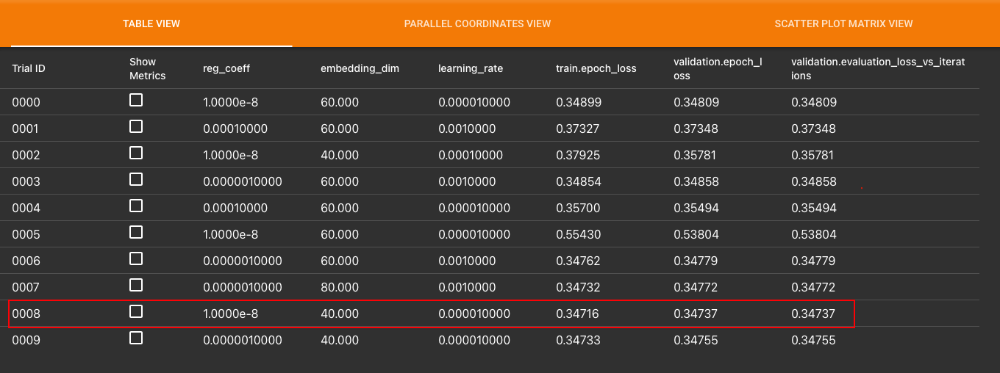

# Neural Network Implementation of Collaborative Filtering Model for Movie Recommendation

[](https://www.python.org/) &nbsp;&nbsp;&nbsp;&nbsp;&nbsp;&nbsp;&nbsp;  &nbsp;&nbsp;&nbsp;&nbsp;&nbsp;&nbsp;&nbsp;

Install all required Libraries given in requirement.txt by using command `pip install -r requirements.txt`.

It's recommended to use [virtualenv](https://virtualenv.pypa.io/en/stable/) and Python 3 (tested with 3.9.12).

# Setup

```bash
$ python3 -m venv .venv
$ source .venv/bin/activate
$ pip install -r requirements.txt

```

# Dataset

## MovieLens

The Movielens dataset is used for training and testing. GroupLens Research has collected and made available rating data sets from the MovieLens web site ([http://movielens.org](http://movielens.org/)). The data sets were collected over various periods of time, depending on the size of the set. Before using these data sets, please review their README files for the usage licenses and other details

# Model Evaulation on Tensorboard

For hyperparameter tuning keras tuner is used and logs can be examined on [tensorboard](http://localhost:6006/).

```bash
$ %load_ext tensorboard
$ tensorboard dev upload --logdir /nncf_tuner/tb_logs

```


